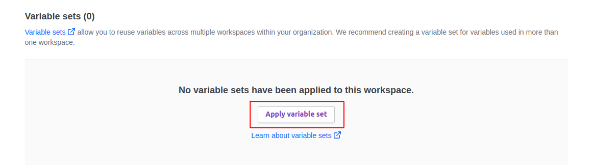

# Basic Setup

## Description

This is the basic setup for a fast-api application

## Setup

1. Prerequisites: Install [docker-compose](https://docs.docker.com/compose/install/)

2. Create a .env file with local env variables. Use `.env.example` as a guide

3. Run [scripts/bigbang.sh](/docs/scripts/bigbang.md) script

## Documentation

How tos:

- [How to create a new model](/docs/how_tos/create_new_models.md)
- [How to create a new endpoint](/docs/how_tos/create_endpoint.md)

Scripts:

- [bigbang](/docs/scripts/bigbang.md)
- [flake8](/docs/scripts/flake8.md)
- [pylint](/docs/scripts/pylint.md)
- [mypy](/docs/scripts/mypy.md)
- [linters](/docs/scripts/linters.md)
- [make_migrations](/docs/scripts/make_migrations.md)
- [migrate](/docs/scripts/migrate.md)
- [tests](/docs/scripts/tests.md)

## CICD/infra setup

To set up a new project in a new repository, complete the following steps:

1. Create the `dev` and `prd` workspaces in [Terraform Cloud](https://app.terraform.io/app/PetFriend/workspaces) (CLI-Driven workflow) and update their names in the `infra/dev/cloud.tfbackend` and `infra/prd/cloud.tfbackend` files.

2. In the variables page for each workspace, add the `Auth dev` or `Auth prd` variable set corresponding to the workspace:
   

3. In the Azure Portal, update the [`dev` app registration](https://portal.azure.com/#view/Microsoft_AAD_RegisteredApps/ApplicationMenuBlade/~/Overview/appId/f53361dc-a218-4361-a3ab-fee2330f6da1/isMSAApp~/false) and the [`prd` app registration](https://portal.azure.com/#view/Microsoft_AAD_RegisteredApps/ApplicationMenuBlade/~/Overview/appId/8f659944-3e44-4a0c-94a9-f859f9f1b933/isMSAApp~/false) with the federated credentials for the `dev` and `prd` workspaces. To do this, go to the _Certificates & secrets_ tab and click on _Federated credentials_. Click _Add credential_ and follow [these steps](https://developer.hashicorp.com/terraform/cloud-docs/workspaces/dynamic-provider-credentials/azure-configuration#configure-azure-active-directory-application-to-trust-a-generic-issuer).

4. Click _Add credential_ again, choose the _GitHub actions deploying Azure resources_ scenario and add a credential for the `dev` and `main` branches to the `dev` and `prd` app registrations respectively.

5. Go to the repository settings for the new repo and copy the variables from the [basic-setup repo](https://github.com/pet-friend/basic-setup/settings/variables/actions). Make sure to keep the exact same names and values for the variables. After that, copy the names of the secrets and create them in the new repo too. You can get their values from our Key Vault on Azure. You need the `Key Vault Administrator` role before you can see them.

   > Note: if the repository is public, you can skip this step, since these variables and secrets are set for the organization (GitHub Free won't allow private repositories to use organization secrets).

6. Update the value for the `app-name` input in the `deploy` job of the GitHub Actions workflow [`.github/workflows/deploy.yml`](./.github/workflows/deploy.yml) with the name of the new service.

## Running terraform locally

You can run terraform locally by using Terraform CLI. To do so, follow these steps:

1. `terraform login` to authenticate with Terraform Cloud
2. `terraform init --backend-config=infra/dev/cloud.tfbackend` to initialize into the dev workspace
3. Create a `terraform.auto.tfvars` in the `infra` folder with the required variables and the ones you want to override. For example:

   ```terraform
   app_name        = "basic-setup"
   container_image = "fdelu/pet-friend:basic-setup-0e2d56d58872280a96612ac25cbe598add4b5b00"
   container_port  = 5000
   ```

After that, you can:

- Run `terraform plan` to see the changes that will be applied
- Run `terraform apply` to apply the changes
- Run `terraform destroy` to destroy the resources
- Run `terraform output` to see the outputs. If you want the database connection details, you can run `terraform output db_connection_details`

## Developing with Visual Studio Code

The following extensions are recommended for developing with Visual Studio Code:

- [Python](https://marketplace.visualstudio.com/items?itemName=ms-python.python): Official Python extension from Microsoft. It provides IntelliSense, linting and more.
- [Black](https://marketplace.visualstudio.com/items?itemName=ms-python.black-formatter): Allows you to format your code using Black automatically.
- [Flake8](https://marketplace.visualstudio.com/items?itemName=ms-python.flake8): Provides support for Flake8 linting.
- [Pylint](https://marketplace.visualstudio.com/items?itemName=ms-python.pylint): Provides support for Pylint linting.
- [Mypy](https://marketplace.visualstudio.com/items?itemName=matangover.mypy): Provides support for type checking with Mypy.
  > Note: This extension runs on the whole workspace, in contrast to Microsoft's Mypy extension, which only runs on the current file and thus doesn't work as well.

It is also recommended to enable `Format on Save` by going to `File > Preferences > Settings` and searching for `Format on Save`.
